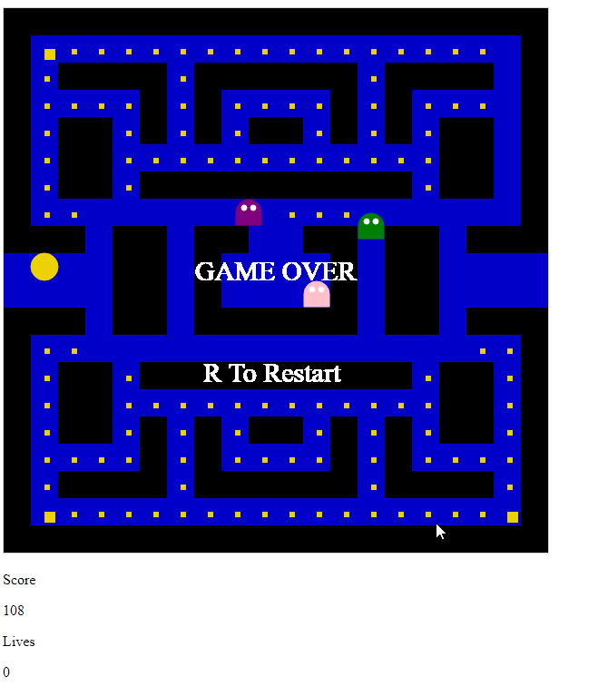

# Pacman in JS
Just a fun little exercise making the classic arcade game.

## Day One
Got some basic features put in Player, Ghosts, Level, level advancement, score, lives, collisions, pellets, power pellets, and some very basic and terrible ghost AI. All assets are just squares of different colors at the moment as I get the logic worked out.

## Day Two
I didn't like how big the steps were because it made the game feel clunky, moving 30 units every draw was pretty nasty. So I changed the player and ghost coordinate system to be more granular which meant breaking and fixing almost everything I did yesterday. 

The player and ghosts now are using the canvas data to detect walls(which may turn out to be a bad idea) they look for black pixels and if they see them wont pass. I handled ghost to ghost and ghost to player collisions but just checking the whole position range which works great for squares, but might be a little sloppy feeling once they are no longer squares. I changed pellet detection to some really sloppy divide and round, so as soon as Pacmans center enters a new square he eats the pellet, surprisingly not terrible. I have a whole host of new bugs but over all its feeling better.

Another new feature is a scary state for Pacman that ties into his super state, so that I can have the ghost run away when he dies. Otherwise he just gets spawn camped.

### Night Two
Had some thoughts came back and squashed some bugs. Ghosts no longer cheat by using the yellow of Pac Square to trick the wall collision algorithm. I also added a bored feature to the ghosts so they will flop to run away behavior when they get stuck. This is a placeholder till i get some different move states rather than run towards and away, but works surprisingly well at generating interesting behavior.

## Day Three
I Made some big strides, I changed some color around, squashed a lot of bugs and made movement feel good. Oh And I now have an animated Pacman and cute ghosts.

This biggest issue I wanted to fix today was the movement. It was uncompromising. So I added a movement queueing system where it saves a key press for a few frames and tries it for you each frame. This makes it so you can hit the key a little early and pacman will still turn. It throws out the turn request after 7 frames, which felt pretty good.

I also added a pause screen and game over state. On top of that I added a reset that lets you clear your score and get all your lives back.

The bugs I got rig of were ghosts clipping walls. This time it was because i drew the ghosts to wide and tall, so they were interfering with their own wall detection.The other bug was the ghosts disappearing into the warp space, I just needed to add a check to keep them from passing it.

Pacman and the ghosts were both made using canvas draw, so this game has 0 assets to load. It really makes no difference, but I thought it would be fun to do it this way.

So here it is in in all it's glory.

For the moment I'm going to call this done. I will probably have my wife play it and see what she thinks since she in the real Pacman fan. There a a ton of things I could improve on.
- The player GUI, at the moment its just 4 restyled lines of text. Really i would like lives to be little pacmen, and for teh score to be drawn on the canvass.
- The ghost ai. It's bad, but works better than I would have thought. In the original game each ghost is a little different and that would be cool to try.
- I have a lot of repeated code between the ghosts and Pacman, making a master entity class to have them both inherit from would clean things up a lot. On top of that breaking things out into a few different files would make it look much better as well. There is a lot of code that was tossed in and not easily maintainable. The whole thing could use some cleanup.
